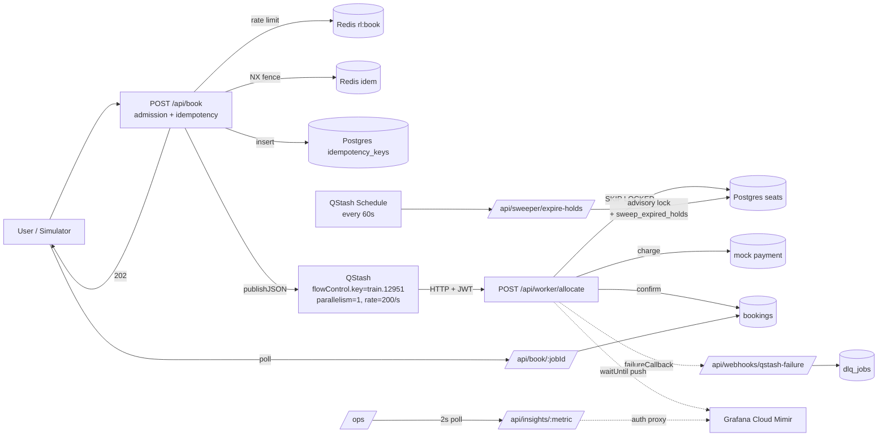

# Trains and Tracks

**Exactly once. Every time.** — a reservation engine that guarantees effectively-once seat allocation under traffic that exceeds planned capacity by orders of magnitude. A simplified IRCTC-Tatkal replacement that demonstrates the failure modes of real-world Indian booking systems (payment-debited-but-no-ticket, duplicate seat allocations, silent request drops) aren't inevitable — they're design choices.

**Live:** https://trains-and-tracks.vercel.app
**Repo:** https://github.com/praanshuranjan321/trains-and-tracks
**Built for:** a 17-hour hackathon · Apr 17 → Apr 18 2026

## The pitch in one paragraph

Every high-profile booking-surge failure (IRCTC Tatkal, BookMyShow's Coldplay, CoWIN, Ticketmaster's Eras Tour) collapsed not from capacity but from **admission**: none of them refused new work fast enough. Users hung. Payments cleared. Tickets didn't. Trains and Tracks handles 100,000 requests in 10 seconds with **zero duplicate allocations, zero payment-without-ticket outcomes, and zero silent hangs** — by composing boring correctness primitives (Stripe-contract idempotency keys, Postgres `FOR UPDATE SKIP LOCKED`, QStash at-least-once + idempotent consumers, Cockatiel circuit breaker, custom Lua sliding-window-log) into a ~2,000-line orchestration layer on top of ~30 lines of vendor glue. The hackathon rule 4.1 penalty for "API-only wrappers" is the explicit reason the line count skews the way it does.

## Architecture



**Three architectural claims** (verbatim in the demo):

1. **Effectively-once execution.** Exactly-once delivery is provably impossible (Two Generals / FLP). We compose at-least-once transport with idempotent consumers at three independent layers: Redis `SET NX EX 60`, Postgres `idempotency_keys` UNIQUE via CTE+UNION, and `bookings.idempotency_key` UNIQUE as the structural backstop.
2. **Orchestration is ours.** QStash is the transport; Supabase is hosted Postgres. Everything else — admission, idempotency, allocation, sweeper, breaker, metrics — is custom. Ratio: `/infra` ≈ 30 LOC of vendor glue vs `/lib` ≈ 2,000 LOC of orchestration.
3. **Admission-controlled by design.** Rate-limit by identity (sliding-window counter 100/10s on the hot path, custom Lua sliding-window-log 30/min on admin). Bounded worker concurrency (Flow Control `parallelism: 1` per train). Fail closed on Postgres (503 `circuit_open`), fail open on Redis (correctness > admission). Every response within `maxDuration=60s`.

## How to run locally

```bash
# Clone + install
git clone https://github.com/praanshuranjan321/trains-and-tracks
cd trains-and-tracks
pnpm install

# Fill in .env.local from .env.example (Supabase + Upstash + Grafana + ADMIN_SECRET)
cp .env.example .env.local && $EDITOR .env.local

# Apply the 17 migrations
pnpm exec tsx scripts/apply-migrations.ts

# Dev server
pnpm dev
```

## How to run the chaos test

```bash
# 1. Point at your deployment and paste ADMIN_SECRET
export APP_URL="https://your-deployment.vercel.app"
export ADMIN_SECRET="..."

# 2. Reset the demo state and fire the suite
pnpm exec tsx scripts/cloud-gate.ts
```

The suite runs:
1. `/api/admin/reset` — clean slate
2. Single e2e booking → poll to CONFIRMED
3. `/api/simulate` with `{requestCount: 500, windowSeconds: 30}` → wait for all terminal
4. Invariant checks: zero-duplicate seat_id in CONFIRMED, inventory reconciles, 0 stuck PENDING
5. Chaos: `kill-worker failNextN:3` → booking still terminates

Budget ~150 QStash messages per run (well under the 1000/day free cap).

Individual chaos tests also exist in [`FAILURE_MATRIX.md §4`](docs/FAILURE_MATRIX.md) — idempotency replay, hash mismatch, Redis kill, hold expiration, concurrent sweeper, payment retry success/permanent fail, sold out, surge correctness.

## Judge-defense map

If a judge asks the classic four questions, here's where the answers live:

| Question | Where it's answered |
|---|---|
| *"What happens when a worker dies mid-booking?"* | `FAILURE_MATRIX.md §3.1` — plus `allocate_seat` returns existing hold on QStash re-delivery (migration 100, DECISIONS running log 2026-04-17 23:57) |
| *"What's your p95 at 2K rps?"* | `/ops` Recharts hero + Grafana panels; target p95 < 200ms per PRD §5.1 |
| *"Isn't this just QStash + Supabase?"* | `DECISIONS.md §3` — 24 ADRs each with context + alternatives + consequences + escape hatch |
| *"Show me your idempotency test."* | `scripts/cloud-gate.ts` step 2 + `CONCEPTS.md §14` rapid-fire Q&A |

**Core documents** (all in `/docs/`):

- [`PRD.md`](docs/PRD.md) — what we're building, scope, success criteria
- [`ARCHITECTURE.md`](docs/ARCHITECTURE.md) — layer-by-layer + deployment topology
- [`DATA_MODEL.md`](docs/DATA_MODEL.md) — 7 tables, 6 stored functions, migration order
- [`API_CONTRACT.md`](docs/API_CONTRACT.md) — 15 endpoints with Zod + error codes
- [`DECISIONS.md`](docs/DECISIONS.md) — 24 ADRs + running log of build-time decisions
- [`FAILURE_MATRIX.md`](docs/FAILURE_MATRIX.md) — 30+ failure modes × mitigations × evolution paths
- [`CONCEPTS.md`](docs/CONCEPTS.md) — 14 patterns with 4-beat defense answers each
- [`RISKS.md`](docs/RISKS.md) — 30-row risk register + hour-by-hour playbook
- [`DEV_BRIEF.md`](docs/DEV_BRIEF.md) — the 17-hour build plan

## Stack at a glance

- **Next.js 16** (App Router, Edge + Node runtimes, `after()` for `waitUntil` semantics)
- **Supabase Postgres** via Supavisor TX pooler (port 6543, `prepare: false`, `max: 1`)
- **Upstash QStash** with Flow Control per-train + `retries: 3` + `failureCallback` DLQ
- **Upstash Redis** for rate limit, idempotency fence, chaos flag, queue-depth cache
- **Cockatiel** composed policy: `wrap(timeout(2s), retry(exp 100→1000), SamplingBreaker(50%/10s))`
- **Prometheus** via `prom-client` 15.1.3 + `prometheus-remote-write` 0.5.1 → Grafana Cloud Mimir
- **pino** JSON to stdout (no transports — Vercel Loki auto-ingest)
- **Recharts** for the live `/ops` hero; **shadcn/ui v4** + Tailwind 4 for everything else

## Known trade-offs and escape hatches

Documented in-place on every ADR. Three worth calling out:

- **Single-region**. Vercel, Supabase, Upstash, Grafana are all one region (`ap-south-1` or closest) for hackathon scope. Evolution path in `FAILURE_MATRIX.md §7` is four-stage and concrete.
- **Mock payment gateway**. Real Stripe/Razorpay integration is a 90-minute swap (same idempotency-key contract) but `PAYMENT_FAILURE_RATE=0.3` gives us controllable failure injection for live demo. Stripe test mode can't do that.
- **QStash free tier**. Hard cap 1,000 msg/day; simulate-surge can exceed. Pay-as-you-go unlocks overage at ~$1 per 100K per PRD §7.2 budget.

---

Built 2026-04-17 → 2026-04-18. Hero photo from [Pexels](https://www.pexels.com/photo/train-station-2031024/). Co-authored with Claude.
