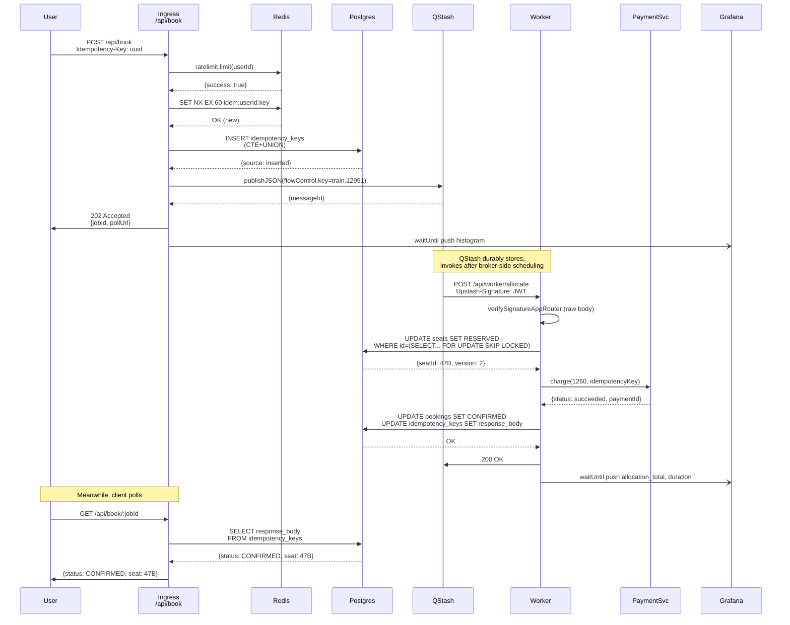
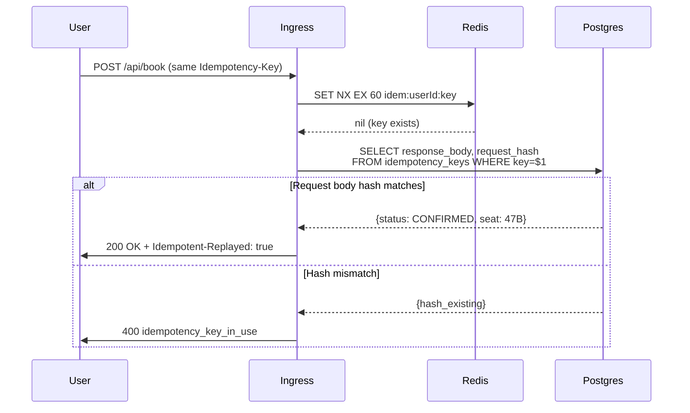
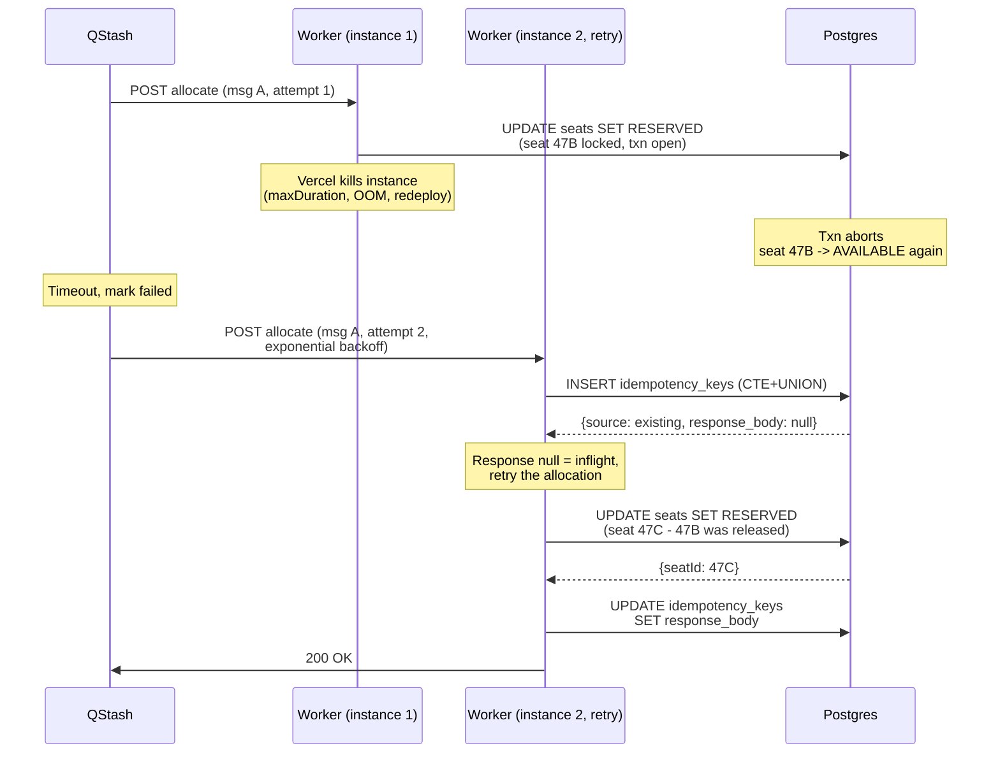
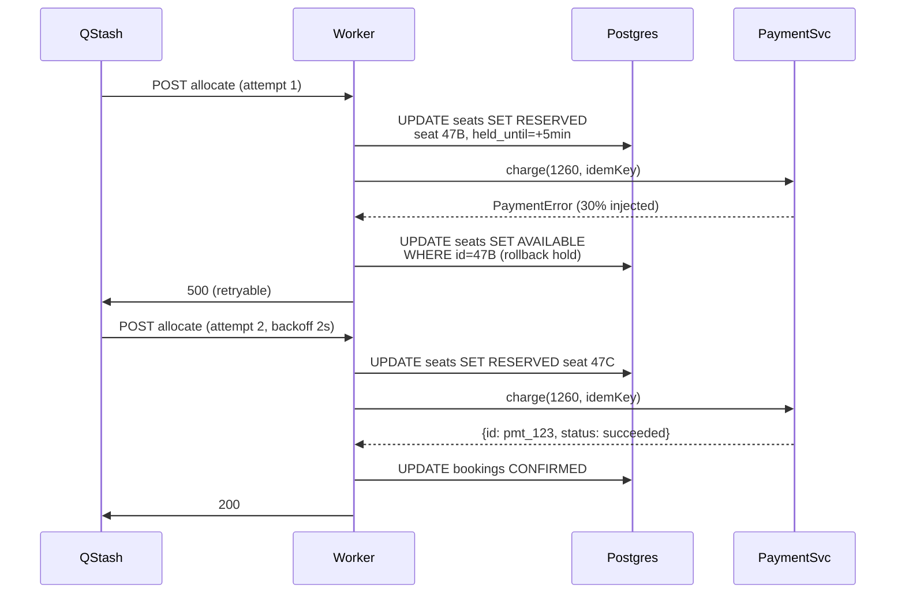
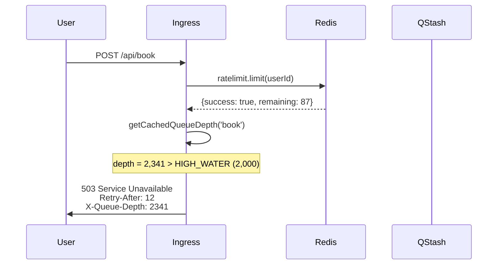
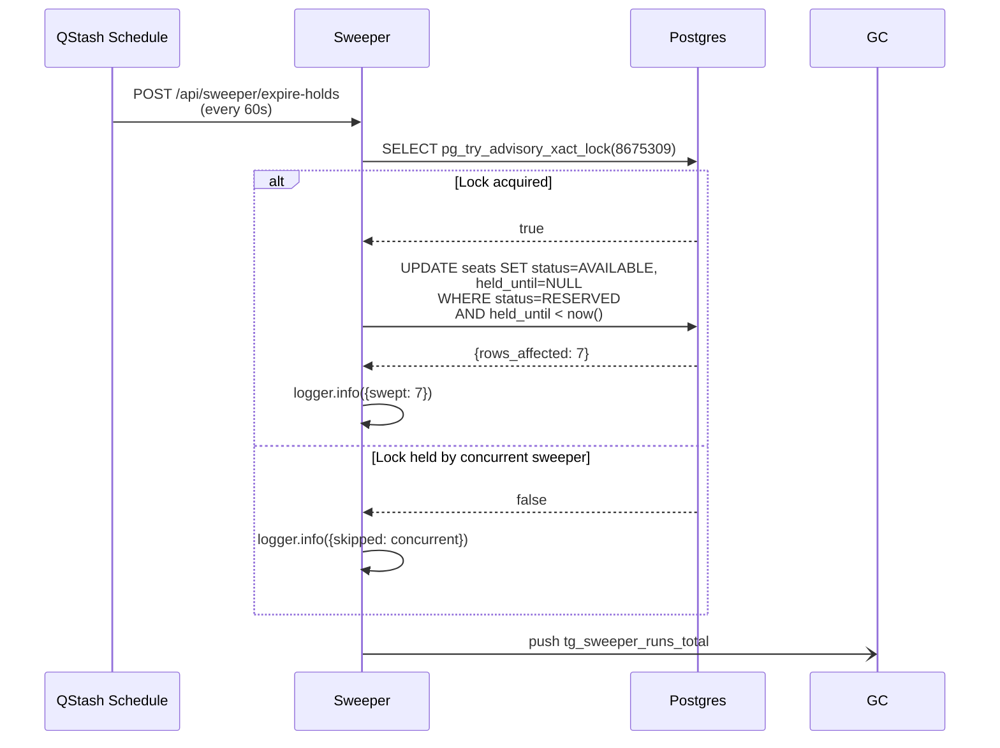
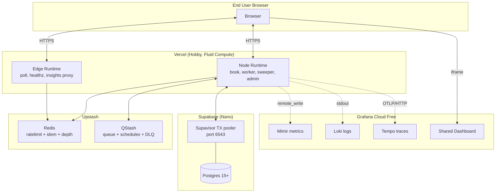

# Trains and Tracks — Architecture Document

**Version:** 1.0 · **Status:** Draft · **Date:** 2026-04-17

---

## 1. System Overview

Trains and Tracks is a **three-layer system**: admission (ingress), transport (queue), resolution (workers). Each layer has a single responsibility and a bounded failure mode. The correctness guarantees of the product (effectively-once seat allocation under surge) emerge from the composition of these layers — no single component holds the guarantee alone.

```mermaid
flowchart LR
  subgraph Client["Client"]
    U[User / Simulator]
  end

  subgraph Admission["Admission Layer (Vercel Edge/Node)"]
    ING[POST /api/book<br/>ingress]
    POLL[GET /api/book/:jobId<br/>poll]
    ADM[POST /api/admin/*]
  end

  subgraph Cache["Fast State (Upstash)"]
    RL[(Redis: ratelimit)]
    IDR[(Redis: idem NX 60s)]
    QDP[(Redis: queue-depth cache)]
  end

  subgraph Transport["Transport (Upstash QStash)"]
    Q[QStash Queue<br/>flowControl key=train.id<br/>parallelism=1, rate=200/s]
    SCH[QStash Schedule<br/>every 60s]
    DLQ[QStash DLQ]
  end

  subgraph Resolution["Resolution (Vercel Node)"]
    W[POST /api/worker/allocate]
    SW[POST /api/sweeper/expire-holds]
    MP[Mock Payment Service<br/>in-process]
  end

  subgraph Storage["Durable (Supabase Postgres)"]
    S[(seats)]
    B[(bookings)]
    IK[(idempotency_keys)]
    PMT[(payments)]
    DLQT[(dlq_jobs)]
  end

  subgraph Obs["Observability (Grafana Cloud)"]
    MIM[Mimir Metrics]
    LOKI[Loki Logs]
    TEMPO[Tempo Traces]
    DASH[Shared Dashboard]
  end

  U -->|1| ING
  ING -->|2 rate check| RL
  ING -->|3 idem check| IDR
  IDR -.miss.-> IK
  ING -->|4 depth check| QDP
  ING -->|5 enqueue| Q
  ING -->|202| U

  Q -->|6 HTTP POST| W
  W -->|verify JWT signature| W
  W -->|7 SKIP LOCKED UPDATE| S
  W -->|8 write booking| B
  W -->|9 idem charge| MP
  MP -->|payment record| PMT
  W -->|10 write response| IK
  W -->|2xx / 489| Q
  Q -.max retries.-> DLQ
  DLQ -.mirror for ops.-> DLQT

  SCH -->|invoke| SW
  SW -->|pg_try_advisory_xact_lock| S

  U -->|poll| POLL
  POLL -->|read response_body| IK

  ING -.waitUntil push.-> MIM
  W -.waitUntil push.-> MIM
  SW -.waitUntil push.-> MIM
  ING -.stdout JSON.-> LOKI
  W -.stdout JSON.-> LOKI

  OPS[/ops page] -->|iframe| DASH
  OPS -->|server-side proxy| MIM
  DASH --> MIM
```

**Read this diagram as three promises:**

1. **Admission promise (layer 1):** every request gets an answer in <200 ms — 202 Accepted, 429 Too Many Requests, or 503 Service Unavailable. No hanging. No silent drops.
2. **Transport promise (layer 2):** QStash guarantees at-least-once delivery. A message accepted at step 5 will be delivered to step 6 at least once, even through Vercel cold starts / worker crashes / network partitions.
3. **Resolution promise (layer 3):** the worker's allocation is idempotent — processing the same message N times produces the same result as processing it once.

**Effectively-once = promise 2 + promise 3 composed.** This is the central architectural claim.

---

## 2. Component Catalog

| # | Component | Responsibility | Runtime | Location |
|---|---|---|---|---|
| 1 | **Ingress** (`/api/book`) | Validate, rate-limit, dedupe, enqueue, return 202 | Node (Vercel Fluid) | `app/api/book/route.ts` |
| 2 | **Poll** (`/api/book/[jobId]`) | Read booking status from idempotency store | Edge | `app/api/book/[jobId]/route.ts` |
| 3 | **Worker** (`/api/worker/allocate`) | Verify sig, allocate seat via SKIP LOCKED, charge, persist | Node | `app/api/worker/allocate/route.ts` |
| 4 | **Sweeper** (`/api/sweeper/expire-holds`) | Release expired holds, gated by advisory lock | Node | `app/api/sweeper/expire-holds/route.ts` |
| 5 | **Simulator** (`/api/simulate`) | Fire N parallel `/api/book` for demo | Node | `app/api/simulate/route.ts` |
| 6 | **Metrics proxy** (`/api/insights/*`) | Server-side Grafana HTTP API query for Recharts | Edge | `app/api/insights/[metric]/route.ts` |
| 7 | **Mock PaymentService** | Idempotent charge with injectable failure | In-process | `lib/payment/mock-service.ts` |
| 8 | **Custom Lua ratelimiter** | 100%-accurate sliding-window-log for admin endpoints | In-Redis | `lib/admission/lua-sliding-log.ts` |
| 9 | **Cockatiel policy** | `wrap(timeout, retry, breaker)` for Postgres calls | In-process | `lib/resilience/pg-policy.ts` |
| 10 | **Idempotency engine** | Redis NX fence + Postgres CTE+UNION authority | Cross-process | `lib/idempotency/*` |
| 11 | **Allocation engine** | Single-statement SKIP LOCKED UPDATE + hold state machine | SQL + wrapper | `lib/allocation/*` |
| 12 | **Metric pipeline** | Remote-write push via `waitUntil` | In-process | `lib/metrics/pusher.ts` |
| 13 | **Landing page** | Hero video + problem story + CTAs | RSC | `app/page.tsx` |
| 14 | **Booking page** | Seat grid + book flow + ticket view | Client | `app/book/page.tsx` |
| 15 | **Ops page** | Grafana iframe + Recharts hero + surge button | Client | `app/ops/page.tsx` |

---

## 3. Data Flow — Happy Path



Total wall-clock: **1.5–4 seconds** under normal load.

---

## 4. Data Flow — Failure Paths

### 4.1 Idempotency replay (client retries)



### 4.2 Worker crash mid-allocation (chaos test)



Result: seat 47C allocated exactly once; no duplicate; `tg_retries_total{stage: allocation} += 1`.

### 4.3 Payment failure + retry



Payment service uses the SAME idempotency key → if attempt 1 actually succeeded before the error was observed, attempt 2 would return the existing payment record. Zero double-charges possible.

### 4.4 Queue saturation (backpressure)



Client uses `X-Queue-Depth` to render a live "queue position ~2,341, ~12 sec wait" message and exponentially back off.

### 4.5 Expired hold release (sweeper)



---

## 5. Tech Stack — versions and justifications

### Runtime / framework

| Component | Version | Why | Why not alternative |
|---|---|---|---|
| Next.js | 16.x (App Router) | Route Handlers map 1:1 to HTTP queue receivers; Fluid Compute tolerates concurrent invocations per instance; single deploy for API + UI. *(Revised from 14.2+ on 2026-04-18; dynamic `params` are now `Promise<{...}>`.)* | Fastify on Railway = second deployment surface; no reason for us |
| TypeScript | 5.4+ (`strict: true`) | Zod schemas + Supabase generated types end-to-end; type errors caught at build | JavaScript: loses the compile-time safety that powers Rule 4.1 claim |
| Node runtime (selected routes) | 20.x LTS (Vercel default) | `pg` / crypto / `verifySignatureAppRouter` need Node APIs | Edge runtime can't do Postgres TCP |
| Edge runtime (selected routes) | — | Used for `/api/book/[jobId]` poll, `/api/healthz` — Redis-only reads; <50ms cold start | Node adds 300–1500ms cold start |

### Storage / transport

| Component | Version / plan | Why | Why not alternative |
|---|---|---|---|
| Supabase Postgres | Nano (free) | Supavisor TX pooler built-in; auth/RLS available if we scope-creep; IPv4-compatible | Self-hosted Postgres = infra overhead in 17h |
| Supavisor (TX pooler) | port 6543 + `?pgbouncer=true&connection_limit=1` | Mandatory for serverless — direct exhausts at ~45 usable connections | Direct: pool exhaustion under burst |
| Upstash QStash | Free → pay-as-you-go | HTTP-based = matches serverless model; Flow Control gives per-train serialization; at-least-once + DLQ | BullMQ needs long-running worker; Inngest's 50K runs/mo cap hits sooner |
| Upstash Redis | Free → pay-as-you-go | HTTP-based = Edge-compatible; Lua EVAL for custom limiter; SET NX EX for idem fence | ElastiCache requires VPC; not serverless-friendly |

### Observability

| Component | Version | Why | Why not alternative |
|---|---|---|---|
| `prom-client` | 15.1.3 | De facto Node Prometheus client; used for in-process registry (push via remote_write, NOT scrape) | scrape endpoint broken on Vercel (per-instance counters) |
| `prometheus-remote-write` | 0.5.1 | Push snappy-framed protobuf to Grafana Mimir inside `waitUntil` | Pushgateway: not supported by Grafana Cloud; Grafana Alloy: needs VM |
| pino | 9.x | 5× faster than winston; Vercel-native JSON-to-stdout; Loki auto-ingests | winston: slower; pino transports break on Vercel (thread-stream) |
| `@vercel/otel` | current | First-class Vercel OpenTelemetry wrapper; auto-propagates trace context; registered in `instrumentation.ts` | Raw `@opentelemetry/*` SDK: more boilerplate; same outcome |
| Grafana Cloud | Free tier | 10K series, 50GB logs, 50GB traces, 14d retention, 3 users — sufficient for hackathon | Self-hosted Prometheus + Grafana: infra cost in 17h unacceptable |

### Libraries of significant custom use

| Library | Version | Where used | Rule 4.1 framing |
|---|---|---|---|
| `@upstash/ratelimit` | 2.0.8 | `/api/book` hot path | Vendor limiter for perf; we ship CUSTOM Lua sliding-window-log on admin endpoints |
| Cockatiel | 3.2.1 | Wraps Postgres calls with `wrap(timeout, retry, breaker)` | Vendor primitive; OUR policy composition + threshold tuning |
| Zod | 3.23+ | Request body validation at every API boundary | Vendor schema lib; OUR schemas |
| `@supabase/supabase-js` | 2.x | `service_role` client for worker schema; PostgREST via HTTPS for Edge | Vendor SDK; OUR data model + SQL |
| `@upstash/redis` | 1.x | Rate limit counters + idem NX + queue depth cache | Vendor SDK; OUR Lua + key scheme |
| `@upstash/qstash` | 2.8.4 | `publishJSON` (ingress) + `verifySignatureAppRouter` (worker) | Vendor transport; OUR Flow Control key design + retry policy + DLQ handling |

### Frontend

| Component | Version | Why |
|---|---|---|
| Tailwind CSS | 4.x | CSS-first config via `@theme`; OKLCH default; plays with shadcn v4 |
| shadcn/ui | 3.x CLI (v4 + React 19) | Accessible primitives; dark theme via `@custom-variant dark (&:is(.dark *))` |
| `tw-animate-css` | current | Replacement for deprecated `tailwindcss-animate` |
| `motion` (formerly Framer Motion) | current | `motion/react` import — spun out in 2025 |
| `gsap` + `@gsap/react` | 3.12+ | 100% free since Webflow acquisition 2024; `useGSAP` handles cleanup |
| Recharts | 2.x | Live bookings/sec hero — React-native SVG; sliding window of N points + 100ms debounce |
| next-themes | current | Avoids theme-flicker with `suppressHydrationWarning` on `<html>` |

---

## 6. Rule 4.1 Ownership Map

This table goes into the README verbatim. Judges scanning for "is this a wrapper?" find their answer here in 15 seconds.

| Concern | Vendor provides | We own |
|---|---|---|
| Durable message transport | QStash at-least-once + DLQ | **Flow Control key design** (`train.{id}, parallelism: 1`), retry decision tree (`Upstash-Retries`, `Upstash-NonRetryable-Error` opt-out at HTTP 489), DLQ drain endpoint, failure callback routing |
| Hot-path rate limiting | `@upstash/ratelimit` sliding-window | **Custom Lua sliding-window-log** for admin endpoints (100% accurate), identifier scheme, ephemeral cache hinting |
| Idempotency primitive | Redis `SET NX EX`, Postgres UNIQUE | **Claim-or-return CTE+UNION engine**, request-hash verification, two-layer reconciler, 24h GC job |
| Seat allocation | Postgres row lock | **SKIP LOCKED pattern in single-statement UPDATE**, hold/release state machine, `held_until` TTL semantics, pg_cron+advisory-lock sweeper |
| Resilience | Cockatiel policies | **Policy composition** (`wrap(timeout, retry, breaker)`), threshold tuning (50% over 10s, min 1 rps), which calls get wrapped, fail-open vs fail-closed choices |
| Metrics storage | Grafana Cloud Mimir | **Metric taxonomy** (12 custom metrics), label cardinality discipline, remote-write pipeline via `waitUntil`, Recharts client-side renderer |
| Tracing backend | Grafana Tempo via OTLP | `@vercel/otel` config + **span taxonomy** + sampling strategy |
| Connection pooling | Supavisor TX | **Connection-limit-1 discipline**, `prepare: false` client config, `pg_stat_activity` fallback monitor for Nov 2025 leak bug |

**Repo line-count ratio to cite to judges:** ~30 LOC of vendor SDK glue vs ~2,000 LOC of orchestration we wrote.

---

## 7. Folder Structure

```
trains-and-tracks/
├── app/                              # Next.js App Router
│   ├── page.tsx                      # Landing (RSC + hero video + problem story)
│   ├── book/
│   │   ├── page.tsx                  # Booking UI (client)
│   │   └── [jobId]/
│   │       └── status/page.tsx       # Confirmation view
│   ├── ops/
│   │   ├── page.tsx                  # Grafana iframe + Recharts hero + surge button
│   │   └── dlq/page.tsx              # P1 — DLQ operator view
│   └── api/
│       ├── book/
│       │   ├── route.ts              # POST ingress
│       │   └── [jobId]/route.ts      # GET poll (Edge)
│       ├── worker/
│       │   └── allocate/route.ts     # QStash consumer (Node)
│       ├── sweeper/
│       │   └── expire-holds/route.ts # QStash Schedule target
│       ├── simulate/route.ts         # Surge simulator
│       ├── insights/[metric]/route.ts # Grafana HTTP API proxy
│       ├── admin/
│       │   ├── dlq/route.ts          # List DLQ jobs (Lua-limited)
│       │   ├── retry/route.ts
│       │   └── kill-worker/route.ts  # Chaos demo
│       └── healthz/route.ts          # Health check (Edge)
│
├── lib/                              # Our orchestration — the Rule 4.1 bulk
│   ├── allocation/
│   │   ├── allocate-seat.ts          # Single-stmt SKIP LOCKED UPDATE
│   │   ├── hold-state-machine.ts     # AVAILABLE ↔ RESERVED ↔ CONFIRMED
│   │   └── sweep-expired.ts          # Advisory-lock-guarded release
│   ├── admission/
│   │   ├── rate-limiter.ts           # @upstash/ratelimit wiring
│   │   ├── lua-sliding-log.ts        # CUSTOM Lua — Rule 4.1 ammo
│   │   ├── queue-depth-gate.ts       # Backpressure 503 gate
│   │   └── headers.ts                # RateLimit-Policy / Retry-After
│   ├── idempotency/
│   │   ├── redis-fence.ts            # SET NX EX 60 pre-flight
│   │   ├── postgres-authority.ts     # CTE+UNION insert-or-return
│   │   ├── request-hash.ts           # Canonical JSON + SHA-256
│   │   └── reconciler.ts             # Cross-store resolution
│   ├── resilience/
│   │   ├── pg-policy.ts              # Cockatiel wrap for Postgres
│   │   └── payment-policy.ts         # Cockatiel wrap for mock payment
│   ├── payment/
│   │   └── mock-service.ts           # Idempotent mock with injectable failure
│   ├── metrics/
│   │   ├── registry.ts               # prom-client setup
│   │   ├── pusher.ts                 # remote_write in waitUntil
│   │   └── names.ts                  # Metric catalog
│   ├── db/
│   │   ├── client.ts                 # Supabase service_role
│   │   ├── schema.ts                 # Drizzle / zod types
│   │   └── advisory-locks.ts         # Named locks
│   ├── logging/
│   │   └── logger.ts                 # pino child logger factory
│   └── tracing/
│       └── otel.ts                   # @vercel/otel config
│
├── infra/                            # ~30 LOC adapters — the vendor surface
│   ├── qstash/publisher.ts
│   ├── qstash/verifier.ts
│   └── redis/client.ts
│
├── components/                       # shadcn + custom UI
├── supabase/
│   └── migrations/                   # SQL migrations (see DATA_MODEL.md)
├── scripts/
│   ├── load-test.ts                  # For local verification
│   └── seed.ts                       # Populate 500 seats
│
├── instrumentation.ts                # @vercel/otel registration
├── DECISIONS.md
├── CONCEPTS.md
├── FAILURE_MATRIX.md
├── RISKS.md
└── README.md
```

---

## 8. Deployment Topology



**One region** — everything in `ap-south-1` (Mumbai) for co-location with Supabase AWS region. Acceptable for hackathon demo; evolution path below.

---

## 9. Scaling Evolution Path (for judge Q&A)

When a judge asks *"how would this handle 10 million users?"* the answer has four stages:

### Stage 1 — current (17-h hackathon build)
- Single Vercel region, Supabase Nano, Upstash free
- 2K rps sustained, 100K burst for 10s
- Cost: $0 + ~$1–2 QStash overage on demo day

### Stage 2 — 100K concurrent (small company)
- Supabase Small tier ($25/mo): 90 direct / 400 pooler, dedicated compute
- Upstash Redis + QStash pay-as-you-go
- Add Redis-backed outbox pattern for QStash publish resilience
- Add CDN for seat grid + landing (Vercel auto)
- Read replica for `/api/book/[jobId]` polling
- Grafana Cloud Pro ($19 base)

### Stage 3 — 1M concurrent (IRCTC-equivalent)
- Move workers to dedicated Node processes on Railway / Fly for deeper Postgres connections
- Postgres horizontal partitioning by train (each train = a shard)
- Upstash Global Redis with MultiRegionRatelimit (accept brief inconsistency for admission)
- Add Verified Fan-style SMS access codes issued day before (decouples login storm from queue)
- Ticketmaster Smart Queue: **randomize queue position at T=0** to defeat first-come bot races
- Move hot-path allocation to a dedicated service with in-process seat cache + periodic Postgres reconciliation

### Stage 4 — true Tatkal scale (3 lakh concurrent + 50% bots)
- Identity binding (Aadhaar / DigiLocker OTP per IRCTC's July 2025 move) replaces CAPTCHA
- Seat inventory in Redis with Postgres as durable ledger (event-sourced)
- Multi-region active-active with consensus on ticket commit
- Pre-admission challenge (PoW / attestation) for unverified identities
- Behavioral bot scoring with outbound SMS verification at admission

**Key point for judges:** the architecture doesn't need to be rewritten; it needs to be scaled. Each stage is a specific change to a specific layer.

---

## 10. Architecture Decision Records (summary — full in `DECISIONS.md`)

| ADR | Decision | Rationale |
|---|---|---|
| ADR-001 | Next.js App Router on Vercel Fluid Compute | Single deploy; Fluid tolerates concurrent invocations per instance |
| ADR-002 | Supabase Nano + Supavisor TX pooler (6543) | Free tier sufficient; TX pooler mandatory for serverless |
| ADR-003 | QStash (HTTP queue) over BullMQ (Redis queue) | BullMQ needs long-running worker — incompatible with Vercel |
| ADR-004 | Flow Control key = train.{trainId}, parallelism: 1 | Per-train serialization at broker → no app-level advisory lock needed |
| ADR-005 | Two-layer idempotency (Redis NX + Postgres UNIQUE) | Redis rejects dup in 5ms; Postgres survives Redis eviction |
| ADR-006 | Single-statement UPDATE ... FOR UPDATE SKIP LOCKED | Single round-trip, plays with TX pooler, scales linearly with workers |
| ADR-007 | Mock PaymentService (no real gateway) | Controlled failure injection for demo; Rule 4.1 avoidance |
| ADR-008 | `prometheus-remote-write` push (not scrape) | Serverless per-instance counters make scrape useless |
| ADR-009 | Grafana Shared Dashboard iframe + Recharts hero | Shared iframe free, fast; Recharts custom for landing branding |
| ADR-010 | Cockatiel policy composition for Postgres calls | TypeScript-native, policy-wrap pattern, threshold tuning |
| ADR-011 | Custom Lua sliding-window-log on admin endpoints | 100% accuracy + explicit Rule 4.1 demonstration |
| ADR-012 | Advisory-lock-guarded sweeper via QStash Schedule | Vercel Cron Hobby daily-only limit; pg_try_advisory_xact_lock prevents double-sweep |

---

**Next doc:** `DATA_MODEL.md` — tables, indices, constraints, migration SQL.
