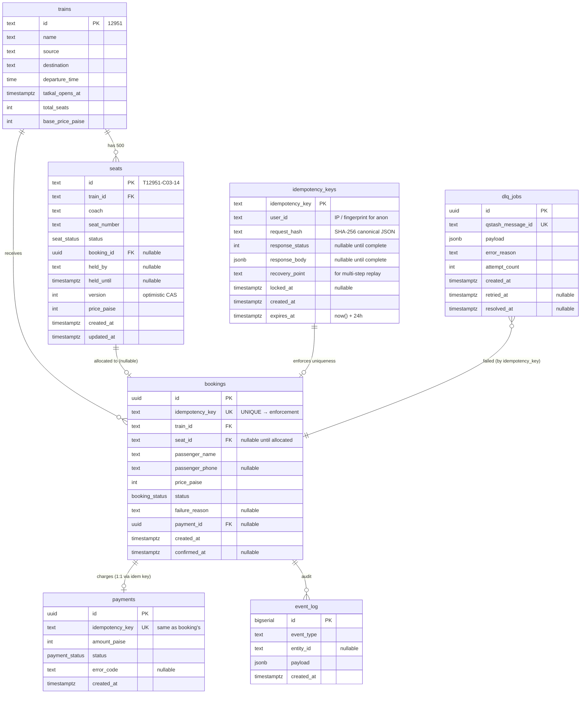

# Trains and Tracks — Data Model

**Version:** 1.0 · **Status:** Draft · **Date:** 2026-04-17

---

## 1. Overview

Seven tables in two logical groups. **All writes go through `service_role`** from our `/api/*` routes — there is no browser-direct DB access, so RLS is deliberately not configured (documented below). Every correctness property lives in a specific constraint, index, or stored function.

### Core domain
- **`trains`** — static reference (train 12951 Rajdhani)
- **`seats`** — 500 rows with state machine (`AVAILABLE → RESERVED → CONFIRMED`)
- **`bookings`** — user booking records, one per `idempotency_key`
- **`payments`** — mock payment records, keyed by same `idempotency_key`

### Orchestration
- **`idempotency_keys`** — Stripe-contract store with request hash + response cache
- **`dlq_jobs`** — mirror of QStash DLQ for operator UI
- **`event_log`** (P1) — audit trail for "nothing lost" demonstration

---

## 2. Entity Relationship Diagram



---

## 3. Enums

```sql
CREATE TYPE seat_status AS ENUM (
  'AVAILABLE',   -- free to be allocated
  'RESERVED',    -- held during payment (held_until enforces TTL)
  'CONFIRMED'    -- payment succeeded, seat permanently allocated
);

CREATE TYPE booking_status AS ENUM (
  'PENDING',     -- received, queued, not yet allocated
  'CONFIRMED',   -- seat allocated + payment succeeded
  'FAILED',      -- permanent failure (no seats, max retries exceeded)
  'EXPIRED'      -- hold expired before payment confirmed
);

CREATE TYPE payment_status AS ENUM (
  'succeeded',
  'failed',
  'pending'
);
```

---

## 4. Table Definitions

### 4.1 `trains` — static reference

```sql
CREATE TABLE trains (
  id                TEXT        PRIMARY KEY,
  name              TEXT        NOT NULL,
  source            TEXT        NOT NULL,
  destination       TEXT        NOT NULL,
  departure_time    TIME        NOT NULL,
  tatkal_opens_at   TIMESTAMPTZ NOT NULL,
  total_seats       INTEGER     NOT NULL CHECK (total_seats > 0),
  base_price_paise  INTEGER     NOT NULL CHECK (base_price_paise > 0),
  created_at        TIMESTAMPTZ NOT NULL DEFAULT now()
);
```

**Why:** keeps hot tables narrow. One row for the hackathon (`12951`); trivially extensible.

---

### 4.2 `seats` — the correctness engine

```sql
CREATE TABLE seats (
  id            TEXT        PRIMARY KEY,                -- "T12951-C03-14"
  train_id      TEXT        NOT NULL REFERENCES trains(id),
  coach         TEXT        NOT NULL,                    -- "C01"–"C20"
  seat_number   TEXT        NOT NULL,                    -- "01"–"25"
  status        seat_status NOT NULL DEFAULT 'AVAILABLE',
  booking_id    UUID,  -- FK added in migration 160 (forward ref to bookings)
  held_by       TEXT,                                     -- passenger name during hold
  held_until    TIMESTAMPTZ,
  version       INTEGER     NOT NULL DEFAULT 0,           -- optimistic concurrency
  price_paise   INTEGER     NOT NULL,
  created_at    TIMESTAMPTZ NOT NULL DEFAULT now(),
  updated_at    TIMESTAMPTZ NOT NULL DEFAULT now(),

  UNIQUE (train_id, coach, seat_number),
  CHECK ((status = 'AVAILABLE' AND booking_id IS NULL AND held_until IS NULL)
      OR (status = 'RESERVED'  AND booking_id IS NOT NULL AND held_until IS NOT NULL)
      OR (status = 'CONFIRMED' AND booking_id IS NOT NULL AND held_until IS NULL))
);
```

**Indexes:**

```sql
-- The seat-allocation hotspot. Partial index on AVAILABLE rows only — small even
-- under pressure. Used by the single-statement UPDATE ... FOR UPDATE SKIP LOCKED
-- subquery. CRITICAL for throughput.
CREATE INDEX seats_avail_idx ON seats (train_id, id)
  WHERE status = 'AVAILABLE';

-- The sweeper reads this. Partial → never scans confirmed rows.
CREATE INDEX seats_held_idx ON seats (held_until)
  WHERE status = 'RESERVED';

-- Booking lookup reverse direction.
CREATE INDEX seats_booking_id_idx ON seats (booking_id)
  WHERE booking_id IS NOT NULL;
```

**Why each field:**

- `id` is human-readable (e.g. `T12951-C03-14`) so logs and error messages are debuggable without joins.
- `version` enables optimistic retries: every UPDATE increments it; the caller can detect if state was stolen.
- `held_by` is redundant with `booking_id → bookings.passenger_name` but avoids a join in the hot path.
- The `CHECK` constraint enforces the state-machine invariant in the database, not just application code. If a bug ever tries to set `status='RESERVED'` without a `held_until`, Postgres rejects it.

---

### 4.3 `bookings` — user intent record

```sql
CREATE TABLE bookings (
  id               UUID           PRIMARY KEY DEFAULT gen_random_uuid(),
  idempotency_key  TEXT           NOT NULL UNIQUE,
  train_id         TEXT           NOT NULL REFERENCES trains(id),
  seat_id          TEXT           REFERENCES seats(id),     -- NULL until allocated
  passenger_name   TEXT           NOT NULL CHECK (length(passenger_name) BETWEEN 1 AND 100),
  passenger_phone  TEXT           CHECK (passenger_phone IS NULL OR length(passenger_phone) BETWEEN 10 AND 15),
  price_paise      INTEGER        NOT NULL,
  status           booking_status NOT NULL DEFAULT 'PENDING',
  failure_reason   TEXT,
  payment_id       UUID           REFERENCES payments(id),
  created_at       TIMESTAMPTZ    NOT NULL DEFAULT now(),
  updated_at       TIMESTAMPTZ    NOT NULL DEFAULT now(),
  confirmed_at     TIMESTAMPTZ
);
```

**Indexes:**

```sql
-- Idempotency lookup (UNIQUE already creates an index, but named for clarity).
-- CREATE UNIQUE INDEX auto-generated: bookings_idempotency_key_key

CREATE INDEX bookings_status_idx ON bookings (status)
  WHERE status IN ('PENDING', 'FAILED');   -- partial: only hot states

CREATE INDEX bookings_created_at_idx ON bookings (created_at DESC);  -- admin list
```

**Why:** `idempotency_key UNIQUE` is the application-level safety net behind the Redis/Postgres idempotency layer. Even if the `idempotency_keys` table write succeeded but the `bookings` insert raced somehow, the UNIQUE constraint still prevents duplicate bookings.

---

### 4.4 `idempotency_keys` — Stripe-contract store

```sql
CREATE TABLE idempotency_keys (
  idempotency_key   TEXT        PRIMARY KEY,
  user_id           TEXT        NOT NULL,          -- IP or fingerprint for anonymous
  request_hash      TEXT        NOT NULL,          -- SHA-256 of canonical JSON body
  response_status   INTEGER,
  response_body     JSONB,
  recovery_point    TEXT        NOT NULL DEFAULT 'started',  -- for future multi-step
  locked_at         TIMESTAMPTZ,
  created_at        TIMESTAMPTZ NOT NULL DEFAULT now(),
  expires_at        TIMESTAMPTZ NOT NULL DEFAULT (now() + INTERVAL '24 hours')
);
```

**Indexes:**

```sql
CREATE INDEX idempotency_keys_expires_at_idx ON idempotency_keys (expires_at);
CREATE INDEX idempotency_keys_user_id_idx ON idempotency_keys (user_id);
```

**Why:**

- `request_hash` — we canonicalize the request body (sort JSON keys, stringify) then SHA-256. On replay: same key + same hash → return cached response with `Idempotent-Replayed: true`. Same key + different hash → HTTP 400 `idempotency_key_in_use`. This is the **Stripe contract**.
- `recovery_point` — unused in this build (single-step booking) but the column is here so future multi-step flows (e.g. external SMS gateway) can resume from a checkpoint per Brandur's pattern.
- `expires_at` + its index → daily cron purges old rows (not in MUST scope).

---

### 4.5 `payments` — mock gateway with same-key idempotency

```sql
CREATE TABLE payments (
  id               UUID            PRIMARY KEY DEFAULT gen_random_uuid(),
  idempotency_key  TEXT            NOT NULL UNIQUE,  -- SAME key as bookings.idempotency_key
  amount_paise     INTEGER         NOT NULL CHECK (amount_paise > 0),
  status           payment_status  NOT NULL,
  error_code       TEXT,
  created_at       TIMESTAMPTZ     NOT NULL DEFAULT now()
);
```

**Why the same key:**

When the worker retries after a payment failure, it calls `paymentService.charge(amount, idempotencyKey)`. The mock gateway does:

```ts
const existing = await db.payments.findByIdempotencyKey(key);
if (existing) return existing;  // replay
// else create new
```

This means **if attempt 1 actually charged the card but the network ate the response**, attempt 2 returns the same `payment_id`. Zero double-charges possible. This is how Stripe's idempotency actually works.

---

### 4.6 `dlq_jobs` — operator mirror of QStash DLQ

```sql
CREATE TABLE dlq_jobs (
  id                UUID         PRIMARY KEY DEFAULT gen_random_uuid(),
  qstash_message_id TEXT         NOT NULL UNIQUE,
  payload           JSONB        NOT NULL,
  error_reason      TEXT         NOT NULL,
  attempt_count     INTEGER      NOT NULL,
  created_at        TIMESTAMPTZ  NOT NULL DEFAULT now(),
  retried_at        TIMESTAMPTZ,
  resolved_at       TIMESTAMPTZ
);

CREATE INDEX dlq_jobs_unresolved_idx ON dlq_jobs (created_at DESC)
  WHERE resolved_at IS NULL;
```

**Why:** QStash's native DLQ (`GET /v2/dlq`) is the source of truth; this table is a cache for the `/ops/dlq` page so operators don't wait on a Upstash API call per list refresh. Populated via failure-callback webhook from QStash.

---

### 4.7 `event_log` (P1 — optional)

```sql
CREATE TABLE event_log (
  id           BIGSERIAL   PRIMARY KEY,
  event_type   TEXT        NOT NULL,
  entity_id    TEXT,
  payload      JSONB,
  created_at   TIMESTAMPTZ NOT NULL DEFAULT now()
);

CREATE INDEX event_log_created_at_idx ON event_log (created_at DESC);
CREATE INDEX event_log_entity_idx ON event_log (entity_id) WHERE entity_id IS NOT NULL;
```

**Why:** audit trail proving no lost bookings. Event types: `booking.received`, `booking.queued`, `booking.allocated`, `booking.payment_succeeded`, `booking.payment_failed`, `booking.confirmed`, `booking.dlq`, `seat.swept`. Cut for P1 because metrics catalog already tells the story.

---

## 5. Stored Functions

### 5.1 `allocate_seat` — the core SQL

```sql
-- Returns 1 row on success, 0 rows if no seats available.
-- Caller checks row count; 0 rows → respond "sold out" with status=FAILED.
-- Critical: single-statement UPDATE with subquery lock is Option C from dossier §8 —
-- Supavisor-TX-compatible, no advisory lock needed, linear worker scaling.

CREATE OR REPLACE FUNCTION allocate_seat(
  p_train_id      TEXT,
  p_booking_id    UUID,
  p_passenger     TEXT,
  p_hold_duration INTERVAL DEFAULT '5 minutes'
) RETURNS TABLE(seat_id TEXT, version INTEGER) AS $$
BEGIN
  RETURN QUERY
  UPDATE seats
     SET status = 'RESERVED',
         booking_id = p_booking_id,
         held_by = p_passenger,
         held_until = now() + p_hold_duration,
         version = version + 1,
         updated_at = now()
   WHERE id = (
     SELECT s.id
       FROM seats s
      WHERE s.train_id = p_train_id
        AND s.status = 'AVAILABLE'
      ORDER BY s.id
      LIMIT 1
      FOR UPDATE SKIP LOCKED
   )
  RETURNING seats.id, seats.version;
END;
$$ LANGUAGE plpgsql;
```

**Key properties:**
- **SKIP LOCKED** — every worker gets a distinct row; no convoy; throughput scales with workers.
- **Single statement** — Postgres auto-wraps in a transaction; safe with Supavisor TX pooler mode.
- **`ORDER BY s.id`** — deterministic allocation order (lower coach/seat numbers fill first).
- **Uses `seats_avail_idx` partial index** — subquery reads only `WHERE status = 'AVAILABLE'` rows.

---

### 5.2 `confirm_booking` — commit on payment success

```sql
-- Called by worker after successful payment. Moves RESERVED → CONFIRMED.
-- Returns 0 rows if hold expired mid-payment (race with sweeper) — caller must refund.

CREATE OR REPLACE FUNCTION confirm_booking(
  p_booking_id    UUID,
  p_seat_id       TEXT,
  p_payment_id    UUID
) RETURNS TABLE(booking_id UUID) AS $$
BEGIN
  UPDATE seats
     SET status = 'CONFIRMED',
         held_until = NULL,
         held_by = NULL,
         version = version + 1,
         updated_at = now()
   WHERE id = p_seat_id
     AND booking_id = p_booking_id
     AND status = 'RESERVED'
     AND held_until > now();

  IF NOT FOUND THEN
    RETURN;  -- hold expired or stolen; caller refunds payment
  END IF;

  RETURN QUERY
  UPDATE bookings
     SET status = 'CONFIRMED',
         payment_id = p_payment_id,
         confirmed_at = now(),
         updated_at = now()
   WHERE id = p_booking_id
  RETURNING id;
END;
$$ LANGUAGE plpgsql;
```

---

### 5.3 `release_hold` — explicit rollback on payment failure

```sql
CREATE OR REPLACE FUNCTION release_hold(
  p_booking_id UUID,
  p_reason     TEXT
) RETURNS INTEGER AS $$
DECLARE
  v_rows INTEGER;
BEGIN
  WITH released AS (
    UPDATE seats
       SET status = 'AVAILABLE',
           booking_id = NULL,
           held_by = NULL,
           held_until = NULL,
           version = version + 1,
           updated_at = now()
     WHERE booking_id = p_booking_id
       AND status = 'RESERVED'
    RETURNING id
  )
  SELECT COUNT(*) INTO v_rows FROM released;

  UPDATE bookings
     SET status = 'FAILED',
         failure_reason = p_reason,
         updated_at = now()
   WHERE id = p_booking_id
     AND status = 'PENDING';

  RETURN v_rows;
END;
$$ LANGUAGE plpgsql;
```

---

### 5.4 `sweep_expired_holds` — scheduled reclaim

```sql
-- Called by sweeper endpoint (QStash Schedule, every 60s).
-- Advisory lock key 8675309 (Jenny's number — arbitrary unique constant).
-- pg_try_advisory_xact_lock releases automatically at txn end (required on Supavisor TX pooler).

CREATE OR REPLACE FUNCTION sweep_expired_holds()
RETURNS TABLE(swept_count INTEGER, skipped BOOLEAN) AS $$
DECLARE
  v_acquired BOOLEAN;
  v_count    INTEGER;
BEGIN
  SELECT pg_try_advisory_xact_lock(8675309) INTO v_acquired;

  IF NOT v_acquired THEN
    swept_count := 0;
    skipped := TRUE;
    RETURN NEXT;
    RETURN;
  END IF;

  WITH expired AS (
    UPDATE seats
       SET status = 'AVAILABLE',
           booking_id = NULL,
           held_by = NULL,
           held_until = NULL,
           version = version + 1,
           updated_at = now()
     WHERE status = 'RESERVED'
       AND held_until < now()
    RETURNING booking_id
  ),
  expired_bookings AS (
    UPDATE bookings
       SET status = 'EXPIRED',
           failure_reason = 'hold_expired',
           updated_at = now()
     WHERE id IN (SELECT booking_id FROM expired WHERE booking_id IS NOT NULL)
       AND status = 'PENDING'
    RETURNING id
  )
  SELECT COUNT(*) INTO v_count FROM expired;

  swept_count := v_count;
  skipped := FALSE;
  RETURN NEXT;
END;
$$ LANGUAGE plpgsql;
```

---

### 5.5 `idempotency_check` — CTE+UNION atomic insert-or-return

```sql
-- The DO NOTHING RETURNING zero-row footgun fix from dossier §3.
-- Always returns exactly one row with source ∈ {'inserted', 'existing'}.

CREATE OR REPLACE FUNCTION idempotency_check(
  p_key          TEXT,
  p_user_id      TEXT,
  p_request_hash TEXT
) RETURNS TABLE(
  idempotency_key  TEXT,
  request_hash     TEXT,
  response_status  INTEGER,
  response_body    JSONB,
  source           TEXT
) AS $$
BEGIN
  RETURN QUERY
  WITH ins AS (
    INSERT INTO idempotency_keys (idempotency_key, user_id, request_hash)
    VALUES (p_key, p_user_id, p_request_hash)
    ON CONFLICT (idempotency_key) DO NOTHING
    RETURNING idempotency_key, request_hash,
              response_status, response_body,
              'inserted'::TEXT AS source
  )
  SELECT * FROM ins
  UNION ALL
  SELECT ik.idempotency_key, ik.request_hash,
         ik.response_status, ik.response_body,
         'existing'::TEXT
    FROM idempotency_keys ik
   WHERE ik.idempotency_key = p_key
     AND NOT EXISTS (SELECT 1 FROM ins)
   LIMIT 1;
END;
$$ LANGUAGE plpgsql;
```

---

### 5.6 `write_idempotency_response` — cache the final response

```sql
CREATE OR REPLACE FUNCTION write_idempotency_response(
  p_key    TEXT,
  p_status INTEGER,
  p_body   JSONB
) RETURNS VOID AS $$
BEGIN
  UPDATE idempotency_keys
     SET response_status = p_status,
         response_body   = p_body
   WHERE idempotency_key = p_key;
END;
$$ LANGUAGE plpgsql;
```

---

## 6. Migration File List

Run in order via Supabase CLI (`supabase migration new ...` or raw SQL via dashboard). All migrations are idempotent via `IF NOT EXISTS`.

```
supabase/migrations/
├── 20260417_000_extensions.sql        # CREATE EXTENSION
├── 20260417_010_enums.sql             # seat_status, booking_status, payment_status
├── 20260417_020_trains.sql            # trains table
├── 20260417_030_seats.sql             # seats table + CHECK + indexes
├── 20260417_040_idempotency_keys.sql  # idempotency_keys + indexes
├── 20260417_050_payments.sql          # payments + UNIQUE on idempotency_key
├── 20260417_060_bookings.sql          # bookings + UNIQUE + indexes
├── 20260417_070_dlq_jobs.sql          # dlq_jobs + partial index
├── 20260417_080_event_log.sql         # (P1) event_log
├── 20260417_100_fn_allocate_seat.sql
├── 20260417_110_fn_confirm_booking.sql
├── 20260417_120_fn_release_hold.sql
├── 20260417_130_fn_sweep_expired_holds.sql
├── 20260417_140_fn_idempotency_check.sql
├── 20260417_150_fn_write_idempotency_response.sql
├── 20260417_900_seed_trains.sql       # single train row
├── 20260417_910_seed_seats.sql        # 500 seats via generate_series
└── 20260417_160_fk_seats_booking_id.sql  # ALTER TABLE seats ADD FK to bookings (deferred mutual FK)
```

### Extensions file (`000_extensions.sql`)

```sql
CREATE EXTENSION IF NOT EXISTS pgcrypto;  -- for gen_random_uuid()
```

Note: `pg_cron` is available on Supabase but we use **QStash Schedules instead** for the sweeper (documented in ADR-012). No pg_cron needed.

---

## 7. Seed Data

### 7.1 Single train

```sql
-- Rajdhani 12951 New Delhi → Mumbai, Tatkal opens "tomorrow 10:00"
INSERT INTO trains (id, name, source, destination, departure_time,
                    tatkal_opens_at, total_seats, base_price_paise)
VALUES (
  '12951',
  'Mumbai Rajdhani Express',
  'New Delhi',
  'Mumbai Central',
  '16:35:00',
  (date_trunc('day', now() + interval '1 day') + time '10:00:00'),
  500,
  126000  -- ₹1260
) ON CONFLICT (id) DO NOTHING;
```

### 7.2 500 seats

```sql
-- 20 coaches (C01–C20) × 25 seats (01–25) = 500 seats
-- IDs look like "T12951-C03-14" for coach 3, seat 14.

INSERT INTO seats (id, train_id, coach, seat_number, status, price_paise)
SELECT
  format('T12951-C%s-%s',
    lpad((seat_num / 25 + 1)::text, 2, '0'),
    lpad((seat_num % 25 + 1)::text, 2, '0')
  ) AS id,
  '12951',
  format('C%s', lpad((seat_num / 25 + 1)::text, 2, '0')),
  lpad((seat_num % 25 + 1)::text, 2, '0'),
  'AVAILABLE'::seat_status,
  126000
FROM generate_series(0, 499) AS seat_num
ON CONFLICT (id) DO NOTHING;

-- Verify
SELECT COUNT(*), status FROM seats GROUP BY status;
-- Expected: 500 | AVAILABLE
```

---

## 8. RLS Posture

**RLS is deliberately NOT configured on any Trains and Tracks table.**

**Justification:**
- All DB access flows through `/api/*` routes on Vercel, which use the `service_role` key.
- `service_role` bypasses RLS by design.
- There is no browser-direct DB access (no Supabase client-side SDK in the frontend).
- Anonymous bookings; no user accounts to scope rows by.

**For judge defense:** *"We skipped RLS because there is no direct browser-to-Postgres path — all reads/writes are mediated by our Next.js API routes using the service_role key. RLS would be theatre here. If we added browser-direct reads (e.g. a subscription to realtime seat updates), we'd enable RLS with `auth.uid() = user_id` policies wrapped in `SELECT` for initPlan caching per Supabase docs' 10×–100× speedup."*

**If we scope-creep into user auth:** enable RLS on `bookings` and `payments`; keep `seats` open-read (public inventory).

---

## 9. Supabase Configuration

### 9.1 Connection strings

```env
# RUNTIME (transaction pooler, port 6543 — MANDATORY for serverless)
DATABASE_URL="postgresql://postgres.<PROJECT_REF>:<PASSWORD>@aws-0-ap-south-1.pooler.supabase.com:6543/postgres?pgbouncer=true&connection_limit=1"

# MIGRATIONS ONLY (direct, port 5432 — from CI or local `supabase db push`)
DIRECT_URL="postgresql://postgres:<PASSWORD>@db.<PROJECT_REF>.supabase.co:5432/postgres"
```

### 9.2 Client config

In `lib/db/client.ts`:

```ts
// postgres-js / Drizzle
import postgres from 'postgres';
const sql = postgres(process.env.DATABASE_URL!, {
  prepare: false,     // REQUIRED for Supavisor TX pooler
  max: 1,             // Match connection_limit=1 in URL
});

// OR supabase-js via PostgREST (HTTPS — Edge-compatible)
import { createClient } from '@supabase/supabase-js';
export const supabaseAdmin = createClient(
  process.env.SUPABASE_URL!,
  process.env.SUPABASE_SERVICE_ROLE_KEY!
);
```

### 9.3 Advisory lock keyspace

| Lock key | Purpose | Scope |
|---|---|---|
| `8675309` | Seat-hold sweeper (only one sweeper at a time) | `pg_try_advisory_xact_lock` |

Only `xact`-scope advisory locks on Supavisor TX pooler — **session-scope locks leak** (dossier §8).

### 9.4 Timeout settings

Set per-transaction in critical paths:

```sql
SET LOCAL lock_timeout = '2s';
SET LOCAL statement_timeout = '3s';
SET LOCAL idle_in_transaction_session_timeout = '5s';
```

Embedded in each stored function call via the client — NOT as global settings.

---

## 10. Operator Monitoring Queries

For `pg_stat_activity` burst watching (per dossier §12):

```sql
-- Connection state during Tatkal surge
SELECT usename, application_name, state, count(*)
  FROM pg_stat_activity
 WHERE datname = 'postgres'
 GROUP BY 1, 2, 3
 ORDER BY 4 DESC;

-- Pool utilization
SELECT sum(numbackends) AS used,
       current_setting('max_connections')::int AS max,
       round(100.0 * sum(numbackends) / current_setting('max_connections')::int, 1) AS pct
  FROM pg_stat_database;

-- Correctness invariant — zero-duplicate check
SELECT seat_id, COUNT(*) AS booking_count
  FROM bookings
 WHERE status = 'CONFIRMED'
 GROUP BY seat_id
HAVING COUNT(*) > 1;
-- Expected: 0 rows at all times. If 1+ rows appear, correctness is broken.

-- Inventory reconciliation after demo
SELECT status, COUNT(*)
  FROM seats
 WHERE train_id = '12951'
 GROUP BY status;
-- Expected post-demo: 500 total = CONFIRMED + AVAILABLE

-- Throughput over last minute
SELECT date_trunc('second', confirmed_at) AS sec,
       COUNT(*) AS bookings_per_sec
  FROM bookings
 WHERE confirmed_at > now() - interval '1 minute'
 GROUP BY 1
 ORDER BY 1 DESC;
```

---

## 11. Summary of Constraints That Enforce Correctness

| Constraint | Table | Enforces |
|---|---|---|
| `idempotency_key UNIQUE` | `bookings` | No duplicate booking ever, even if Redis + idempotency_keys both bypass |
| `idempotency_key UNIQUE` | `payments` | No duplicate charge for same booking retry |
| `UNIQUE (train_id, coach, seat_number)` | `seats` | Seat ID cannot be duplicated |
| `CHECK ((status='AVAILABLE' AND ...) OR ...)` | `seats` | State machine invariant enforced by DB, not just code |
| `REFERENCES bookings(id) ON DELETE SET NULL` | `seats.booking_id` | Cleanup safety |
| `CHECK (length(passenger_name) BETWEEN 1 AND 100)` | `bookings` | Input validation backstop |
| `FOR UPDATE SKIP LOCKED` in `allocate_seat` | (function) | No worker convoy; scales linearly |
| `pg_try_advisory_xact_lock(8675309)` in sweeper | (function) | No double-sweep under concurrent schedule runs |

**Every correctness guarantee in the PRD traces to one of these constraints or functions. None of it is application-code trust.**

---

**Next doc:** `API_CONTRACT.md` — endpoints, request/response shapes, error codes, idempotency headers.
